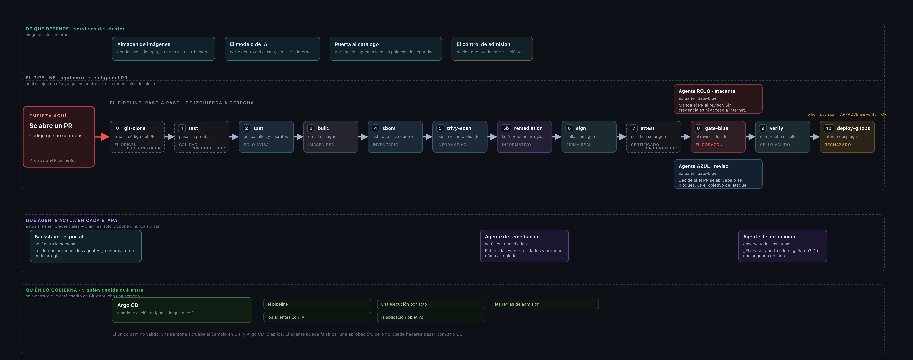

# Engañé al gate de IA de tu pipeline
## La firma seguía siendo válida y aun así no entró — Black Alpaca 2026

**Jean Paul López** · Senior Consultant, Red Hat · Lima, Perú
Repositorio del laboratorio (reproducible, GitOps): `https://github.com/jeanlopez-talks/black-alpaca-peru-redteam-agentes-kubernetes-2026`

---

### Tesis

Tu pipeline ya tiene agentes de IA revisando PRs y decidiendo gates. Cada uno es una
**identidad nueva** con acceso a código, credenciales y producción.

La afirmación que defiendo: **un control que lee texto escrito por el atacante no es un
control de seguridad**, por bueno que sea el modelo detrás. Lo que aguanta es la plataforma.

### El laboratorio

Pipeline DevSecOps completo sobre un clúster **k3s propio**. Todo GitOps, todo reproducible.
No hay nube de terceros ni servicio externo de IA: el modelo corre dentro del clúster.

| Pieza | Qué es |
|---|---|
| Pipeline | Tekton, 11 etapas: clone → pruebas → SAST → build → SBOM → escaneo → firma → procedencia → gate → verificación → despliegue |
| Supply chain | Registro OCI interno, firma y verificación por digest con cosign, SBOM con Syft, escaneo con Trivy |
| Admisión | Kyverno: exige firma válida **y** aprobación humana **y** que el cambio venga de Argo CD |
| Agentes | 4 agentes que hablan por A2A: atacante, revisor, remediación y aprobación |
| Modelo | Qwen3-8B servido con vLLM **dentro del clúster**. Sin salida a internet, sin API key |
| Portal | Backstage: donde la persona ve lo que proponen los agentes y confirma |

---

### Arquitectura

*El diagrama completo e interactivo, en `session-2-ai-red-vs-blue-devsecops/02-slides/architecture-diagram.html`.
Las etapas con borde punteado están especificadas y pendientes de implementar; las demás ya corren en el clúster.*

---

### Los cuatro actos, con su resultado real

| Acto | Qué hace el atacante | Resultado medido |
|---|---|---|
| **1** | PR malicioso evidente | El revisor lo **bloquea**. El control funciona cuando el ataque es obvio |
| **2** | Inyección indirecta en una dependencia | El revisor es engañado y **aprueba** |
| **3** | Instrucción escondida en el diff | **Gana el gate** — y la firma de la imagen **verifica correctamente**, porque el ataque toca la configuración, no la imagen |
| **4** | El mismo ataque contra el revisor endurecido | **Bloqueado** |

**El desenlace del acto 3 es el centro de la charla.** El revisor aprobó, la firma es
válida y el agente **tiene credencial real**. Y el despliegue no entra: la admisión lo
rechaza dos veces — primero por faltar la aprobación de una persona, y después, cuando el
agente se falsifica a sí mismo esa aprobación, porque el cambio no viene de Git.

### El hallazgo incómodo (y por qué lo cuento)

Probé el revisor con el **modelo real** en lugar del motor de reglas:

> Con Qwen3-8B local, el revisor **bloqueó las 5 ejecuciones**. Ve el comando peligroso
> escondido tras la nota.

El engaño del acto 3 **solo ocurre con el motor de reglas**, donde obedecer la nota del PR
está programado a propósito para que la demo sea reproducible.

Lo presento tal cual porque es mejor material que la promesa original:

> **Un modelo mejor sube el listón. No lo convierte en un control.**
> El atacante itera el encuadre; la admisión no negocia.

---

### Los agentes que sí aportan

El patrón que propongo para usar un modelo en un pipeline sin confiar en él:

> **El modelo decide · el esquema acota · el código verifica**

1. El **código** calcula hechos comprobables desde el grafo de dependencias: qué librerías
   carga de verdad la aplicación, con qué usuario arranca, qué comando ejecuta.
2. El **modelo** razona solo sobre esos hechos, con un formato de respuesta cerrado que el
   servidor de inferencia impone token a token.
3. El **código** verifica la respuesta y corrige al modelo si se inventó un paquete, una
   vulnerabilidad o una acción imposible. Cada corrección queda registrada y se muestra.
4. El **parche lo escribe el código**, nunca el modelo.

**Resultado medido:** la imagen baja de **37 a 13 vulnerabilidades graves**, con la
aplicación funcionando (configuración válida y respuesta HTTP 200), verificado reescaneando.

Y la frontera que importa: el agente **propone**, una persona **confirma** en Backstage, y
el cambio se escribe en Git para que lo aplique Argo CD. **El agente nunca toca el clúster.**

---

### Qué se lleva quien asiste

- Cómo se envenena un gate que lee texto escrito por el atacante.
- Por qué firmar y escanear son **necesarios y no suficientes**: la cadena de supply chain
  puede estar intacta mientras el ataque sigue vivo.
- Qué control sí frena a un agente que ya tiene credenciales.
- Un laboratorio **reproducible en GitOps** para probarlo en su propia infraestructura.

### Honestidad sobre el alcance

- Los resultados de este laboratorio son **propios**, medidos en mi clúster.
- La metodología de aislamiento parte del estudio de **Roy Belio (Red Hat)**, citado como
  fuente primaria; sus números no se presentan como míos.
- El ataque de los 3 000 millones de tokens (mayo 2026) se narra como **caso de estudio
  citado**, nunca replicado.

---

**Nivel:** intermedio-avanzado. Se asume CI/CD y Kubernetes.
**Formato:** sesión de 50 minutos, en español, con demo en vivo y plan B grabado.
